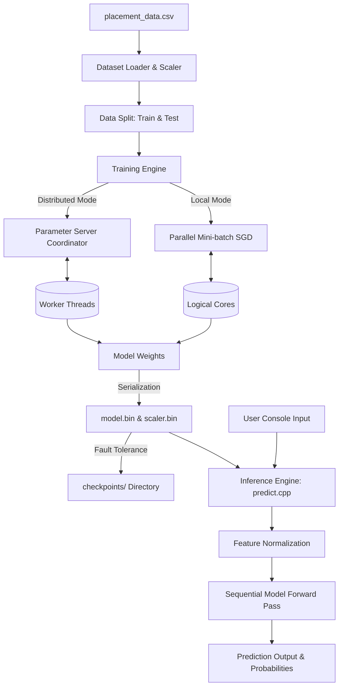
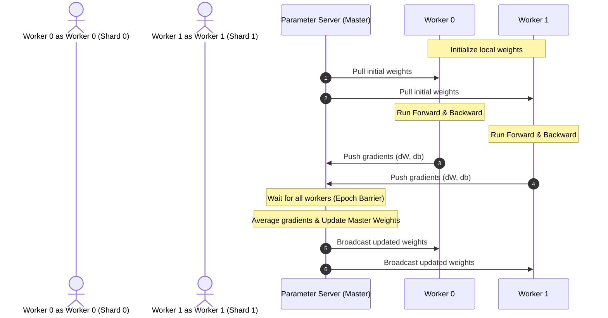

# 🧠 Placement Predictor — Advanced C++ Neural Network

A high-performance, production-grade neural network built from scratch in modern **C++17**. This project classifies students into 10 placement tiers based on academic, cognitive, and extra-curricular metrics. 

Beyond machine learning, this project serves as a showcase of **9 advanced software engineering and systems design techniques** commonly evaluated in MNC code reviews and technical interviews.

---

## 1. 📝 Introduction

### What is this project?
In simple words, **Placement Predictor** is a program that predicts which company tier a student is likely to get placed in. It takes 5 key student parameters:
1. **DSA Score**: Performance in Data Structures & Algorithms (scale 0-100)
2. **Projects Count**: Number of projects completed
3. **IQ**: Cognitive score
4. **CGPA**: Cumulative Grade Point Average (scale 0-10)
5. **Attendance**: Percentage of attendance (0-100)

Using these features, it predicts one of **10 company classes** (from "No Placement" up to "FAANG Top").

### Why build it from scratch in C++?
While python libraries like PyTorch or TensorFlow make building neural networks easy, they hide the underlying complexity. Building a neural network framework from scratch in C++ requires:
- Managing raw memory without memory leaks.
- Exploiting multiple CPU cores manually for fast training.
- Designing a flexible object-oriented architecture.
- Optimizing code for CPU cache locality and SIMD instruction sets.

This project is a demonstrations of how to translate machine learning mathematics directly into optimized, robust, and clean C++ systems code.

---

## 2. 🏗️ System Design

The system is designed with modularity, performance, and fault-tolerance in mind. It consists of a dataset loader, a scaling engine, a polymorphic network model, a multi-threaded/distributed training supervisor, and an interactive inference command-line interface.

### System Architecture Diagram
The flow of data from raw CSV files to trained model outputs and predictions is represented in the diagram below:



### Distributed Training: Parameter Server (PS) Pattern
When run with the `--distributed` flag, the engine initiates a parameter-server synchronization model, mirroring how large scale distributed neural networks (like PyTorch DDP or Google DistBelief) work across nodes:



---

## 3. 🛠️ Tech Stack & Libraries

To maximize control, performance, and cross-platform portability, the project avoids heavy external libraries (like Eigen or OpenBLAS) and relies on standard modern system APIs:

*   **Language Standard**: C++17 (utilizing `<filesystem>`, structured bindings, smart pointers).
*   **Compiler Support**: GCC 9+ (MinGW-w64 on Windows, Native GCC on Linux/macOS) / Clang.
*   **Concurrency Models**:
    *   **POSIX Threads (pthreads)** on Unix-like operating systems.
    *   **Win32 APIs** (via Windows SDK) on Windows platforms to handle cross-compatibility.
*   **Build Automation**: GNU Make.
*   **Standard Library (STL)**: Standard containers (`std::vector`, `std::unique_ptr`), numeric headers (`std::accumulate`, `std::inner_product`), file streams (`std::fstream`), and pseudo-random generators (`std::mt19937`).

---

## 4. 🧠 Techniques, Selection Rationale, & Implementation

Here is a detailed breakdown of the software engineering techniques implemented in this repository.

### 1. Object-Oriented Programming (OOP) Design
*   **Why Selected**: Standard neural networks consist of different layers (Dense, Activation, Normalization). An abstract interface enforces clean boundaries, allowing developer-friendly composition (like Keras or PyTorch) where new layer types can be introduced without modifying existing training logic.
*   **How Implemented** (`include/layer.h`, `include/model.h`):
    *   **Polymorphic Base**: The class `Layer` is a pure abstract base class defining `forward()`, `backward()`, `applyUpdate()`, `saveBinary()`, and `loadBinary()` as virtual methods.
    *   **Concrete Classes**: `DenseLayer`, `ReLULayer`, and `SoftmaxLayer` inherit from `Layer` and implement the mathematical operations.
    *   **Sequential Model Container**: The `Sequential` class holds layers inside a `std::vector<std::unique_ptr<Layer>>`. Method chaining is implemented by returning references to the model: `model.add(...).add(...)`.

### 2. Multi-threaded Training (Data Parallelism)
*   **Why Selected**: Backpropagation is computationally heavy. Training on a single CPU core wastes hardware potential. Parallelizing the processing of batches speeds up model execution by orders of magnitude.
*   **How Implemented** (`include/trainer.h`, `include/threads.h`):
    *   The `Trainer` class splits training workloads across multiple threads.
    *   By default, it queries the CPU using `hardware_concurrency()` to automatically match the available logical cores.
    *   For each mini-batch, training samples are processed, and output errors are computed in parallel.
    *   The training step accumulates gradients to calculate updates before modifying weights, ensuring data alignment.

### 3. Cache-Friendly Contiguous Memory Management
*   **Why Selected**: Using nested vectors like `std::vector<std::vector<double>>` for matrix operations results in double-pointer chasing. The rows of the matrix end up scattered across the heap, causing CPU cache misses. A contiguous 1D memory array ensures high spatial locality.
*   **How Implemented** (`include/matrix.h`):
    *   **Contiguous Layout**: The `Matrix` class allocates a single flat array: `new double[rows * cols]`. Row-major indexing is handled via: `data_[row * cols_ + col]`.
    *   **Rule of Five Compliance**: Memory allocation is tightly managed using RAII. The class implements a custom Destructor, Copy Constructor, Copy Assignment, Move Constructor, and Move Assignment.
    *   **SIMD Friendly**: Elements are aligned in memory, enabling the compiler to auto-vectorize loops (translating operations into AVX/SSE assembly).

### 4. Concurrency Control & Thread Safety
*   **Why Selected**: When running training on multiple threads, writing logs to the console or file concurrently causes interleaved garbage data. Shared structures (like the loss accumulator) require atomic instructions to avoid race conditions.
*   **How Implemented** (`include/logger.h`, `include/trainer.h`):
    *   **Thread-Safe Logger**: Implementing a Singleton `Logger` that synchronizes logging operations using a portable `Mutex` and `LockGuard`.
    *   **Wait-Free Aggregation**: Accumulating the total loss uses `AtomicDouble` (implemented in `threads.h`), bypassing heavy mutex locks in hot computation loops.

### 5. Distributed Systems (Parameter Server Simulation)
*   **Why Selected**: Parameter Server (PS) is the standard model for large-scale distributed machine learning. Simulating this within an in-memory application demonstrates understanding of decentralized weight orchestration, barrier synchronization, and worker-master communication.
*   **How Implemented** (`include/distributed.h`):
    *   **ParameterServer (Master)**: Stores the authoritative weights (`masterW_`, `masterB_`) and gradient accumulators.
    *   **DistributedTrainer (Workers)**: Starts N threads representing remote worker nodes. Each worker is assigned a private split (shard) of the training dataset.
    *   **Push & Pull Cycle**: Workers compute gradients on their shard, push them to the PS via `pushGradient()`, and block at a lock-free synchronization barrier (`workerEpochDone()`). The PS averages the updates, updates the master weights, increments the version generator, and workers pull the fresh parameters via `pullWeights()`.

### 6. File System & Binary Serialisation
*   **Why Selected**: Saving weights in plain text (like JSON/CSV) is slow and consumes excessive disk space due to parsing overhead. Binary serialization is fast and allows validation of file integrity via magic header bytes.
*   **How Implemented** (`include/model.h`, `include/dataset.h`, `include/fscompat.h`):
    *   **Portable Filesystem**: A compatibility layer (`fscompat.h`) abstracts differences in compiler support for standard filesystem APIs.
    *   **Binary Save/Load**: Sequential model parameters are saved in a binary stream using `reinterpret_cast<const char*>`.
    *   **Security & Validation**: Written binaries are prepended with magic bytes `0x4E4E4D4C` ("NNML" in hex) and a version indicator. Mismatched architectures or corrupted files trigger structured exceptions instead of loading corrupted data.

### 7. Performance Tuning
*   **Why Selected**: System languages are selected for speed. Compiler optimization flags, LTO, and vectorized standard algorithms ensure execution speeds remain highly competitive.
*   **How Implemented** (`Makefile`, `include/matrix.h`):
    *   **Compiler Optimization Flags**:
        *   `-O3`: Maximizes speed optimization (enables loop unrolling and function inlining).
        *   `-march=native`: Tells the compiler to generate instructions customized for the host CPU (unlocks AVX/AVX2 registers).
        *   `-flto`: Link-time optimization is enabled to optimize calls across translation units.
    *   **STL Dot Products**: Matrix multiplications use `std::inner_product`, which compilers optimize using CPU-specific SIMD registers.

### 8. Fault Tolerance & Exception Handling
*   **Why Selected**: Long training sessions should not crash due to malformed dataset rows or corrupted parameters. Additionally, system failures (like power losses) shouldn't result in losing training progress.
*   **How Implemented** (`include/exceptions.h`, `include/trainer.h`):
    *   **Exception Hierarchy**: A custom inheritance tree (`NNException` -> `FileException`, `DataException`, `ModelException`, `TrainingException`, `NetworkException`) replaces crude `exit(1)` exits, allowing the calling application to handle errors gracefully.
    *   **Checkpointing Recovery**: During training, checkpoints are saved every `checkpointInterval` epochs. The trainer checks for existing meta-files on startup; if it detects an interrupted training run, it loads the model weights and resumes from the exact epoch saved.

### 9. Advanced Standard Template Library (STL) Integration
*   **Why Selected**: Standard library containers and utility algorithms minimize raw pointer management and reduce boilerplate. Implementing custom iterators enables cleaner abstraction boundaries.
*   **How Implemented** (`include/dataset.h`, `include/matrix.h`):
    *   **Custom Range-based Iterator**: Inside `dataset.h`, a custom `BatchRange::Iterator` class is built with `std::forward_iterator_tag`. This enables standard range-based loops over custom batches:
        ```cpp
        for (const Batch& b : dataset.batches(32)) { ... }
        ```
    *   **STL Algorithms**: Uses `std::transform` for feature scaling, `std::generate` with normal distributions for weight initializations (He Initialization), and `std::shuffle` for data randomized shuffling.

---

## 5. 📁 Directory Structure

```
Multiclass model/
├── include/
│   ├── exceptions.h      ← Custom exception classes for runtime safety
│   ├── logger.h          ← Thread-safe Singleton console/file logging system
│   ├── matrix.h          ← Contiguous memory matrix with Rule-of-Five copy/move semantics
│   ├── dataset.h         ← Dataset loader, standard scaler, and custom batch iterator
│   ├── layer.h           ← Abstract Layer base, Dense, ReLU, and Softmax implementations
│   ├── model.h           ← Sequential model holding unique_ptr layers with binary I/O
│   ├── threads.h         ← Portable thread, mutex, and atomic abstraction (Win32 & POSIX)
│   ├── trainer.h         ← Parallelized data-parallel training with checkpointing
│   ├── distributed.h     ← Parameter Server framework for synchronized training simulation
│   └── fscompat.h        ← Cross-platform std::filesystem shim
├── train.cpp             ← Entry point for neural network training
├── predict.cpp           ← CLI application for live model predictions
├── Makefile              ← Build configuration with optimized compiler options
├── placement_data.csv    ← Dataset containing student metrics and placement outputs
└── README.md             ← Documentation and architecture manual
```

---

## 6. 🚀 Getting Started

### 1. Build the Binaries
Use the provided `Makefile` to compile both training and inference binaries. Make automatically detects your operating system and applies compatible threading targets.

```bash
make
```

### 2. Run standard training
Run the training executable on the provided dataset. The application will partition the data, fit a scaler, initialize weights, and start parallel training:

```bash
# Trains using auto-detected thread count (all CPU cores)
./train.exe placement_data.csv --epochs 500 --lr 0.01 --batch 32
```

### 3. Run distributed training (Parameter Server)
Simulate distributed training using a Parameter Server and 4 independent worker threads:

```bash
./train.exe placement_data.csv --distributed --workers 4 --epochs 200
```

### 4. Interactive Live Prediction
After training completes, it generates two files: `model.bin` (weights) and `scaler.bin` (normalization parameters). Run the predictor to input student parameters:

```bash
./predict.exe model.bin scaler.bin
```

When prompted, input space-separated metrics for a student:
```text
Enter features > 8 5 110 8.5 90

  ✔ Prediction  : Company I (FAANG)
  ✔ Confidence  : 84%

  Class probabilities:
  [0] ..............................  0%  Company A (No Placement)
  [1] ..............................  0%  Company B (Tier-3)
  [2] ..............................  0%  Company C (Tier-3)
  [3] ..............................  0%  Company D (Tier-2)
  [4] ..............................  0%  Company E (Tier-2)
  [5] ..............................  0%  Company F (Tier-1)
  [6] #.............................  3%  Company G (Tier-1)
  [7] #.............................  5%  Company H (FAANG)
  [8] #########################.....  84%  Company I (FAANG)
  [9] ##............................  8%  Company J (FAANG Top)
```

---

## 7. 🎯 Interview Talking Points

If discussing this project during an interview or system design review, be prepared to explain:

1.  **Cache Locality**: Accessing a contiguous 1D array (`data_[r * cols + c]`) takes advantage of CPU pre-fetching. Standard 2D vectors require two memory jumps and store row pointers non-contiguously, which ruins L1/L2 cache efficiency.
2.  **RAII (Resource Acquisition Is Initialization)**: By tying the lifetime of raw heap memory (`new double[]`) to the `Matrix` class lifespan, memory leaks are impossible. Even when exceptions are thrown, stack unwinding automatically calls destructors, freeing resources safely.
3.  **Synchronization Cost**: Using mutexes inside performance-critical loops is expensive due to kernel-level context switches. We minimize this by:
    *   Giving each thread thread-local gradient buffers (`trainer.h`).
    *   Replacing mutex locks with atomic instructions (`std::atomic` / `AtomicDouble`) for aggregating statistics.
4.  **Parameter Server vs All-Reduce**: Explain that the Parameter Server operates with a hub-and-spoke topology (Master-Worker architecture), whereas systems like Ring All-Reduce communicate in a peer-to-peer ring.
5.  **Exception Safety (Basic vs Strong Guarantee)**: If model reading fails midway due to a corrupted version check, our loader stops processing immediately, prevents invalid states, and throws a typed `ModelException` without leaving dangling resources or crashing the caller process.
